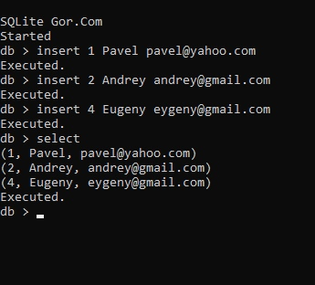

# Реляционная СУБД SQLite

Локальная файловая реляционная СУБД.
Архитектура основана на SQLite.
Доступ к базе данных осуществляется с помощью SQL-запросов из командной строки.

Состоит из:
- командного интерпретатора
- компилятора SQL
- виртуальной машины

Написана на языке C.

Статус проекта: Разрабатывается.

## Лицензия

Copyright (c) 2022 Evgeny Goryachev
Gor.Com 

